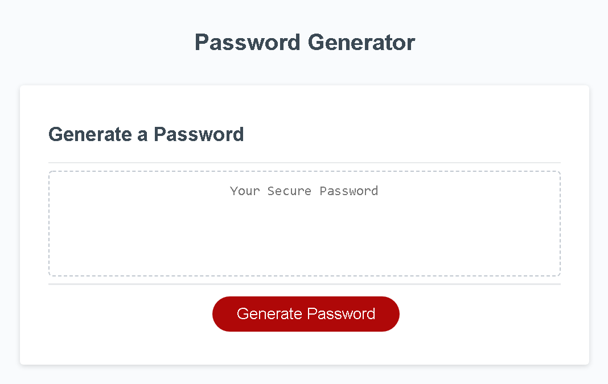
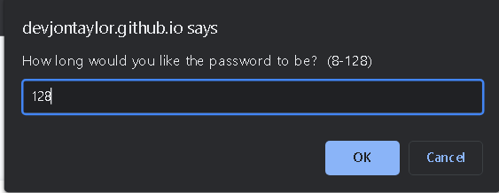
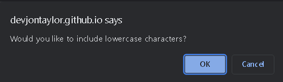
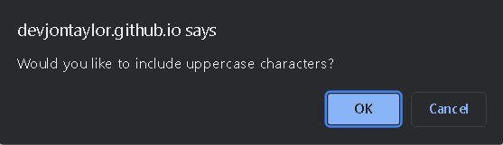
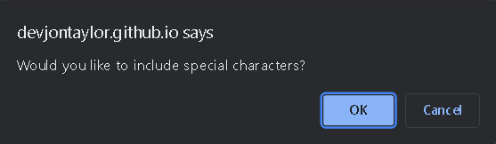
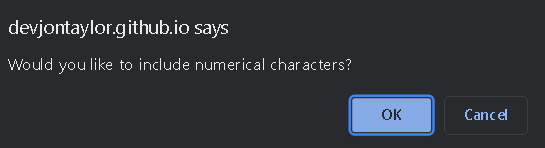
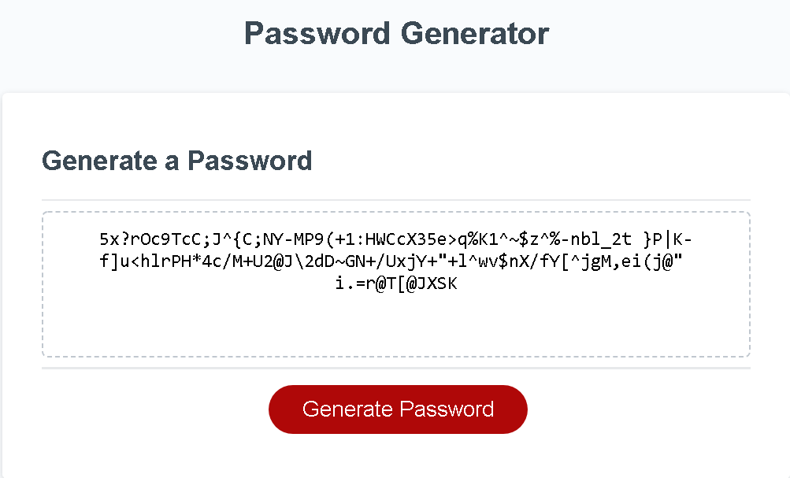
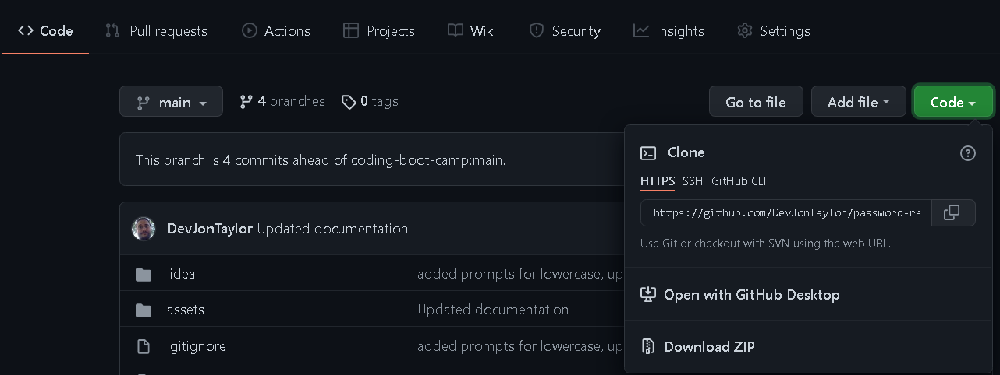

# Password Generator
  

A simple request to generate passwords that will allow the user
to decide if they want lowercase, uppercase, numeric, and special
characters.  The password should display either inside an alert
or the webpage.  This project allowed to work with ES6 syntax a
little bit and I built the password generator as a class.


## Goals

- [x]  Lowercase characters
- [x]  Uppercase characters
- [x]  Numeric characters
- [x]  Special characters
- [x]  Length between 8-128
- [x]  Displays on webpage


## Demo

You can access the deployed application [here](https://devjontaylor.github.io/password-randomizy/)

## Examples













## Deployment

To deploy the project you can simply download the zip from GitHub
or you can Clone it using git inside a terminal or command-line
interface(CLI).

### Download Zip

1. Click Code button on the right
2. Select Download zip
   

### Clone
```bash
git clone https://github.com/DevJonTaylor/password-randomizy.git
```

Then just open the index.html file inside a browser.


## License

[MIT](./LICENSE)


## Authors

- [Jon Taylor](https://www.github.com/devjontaylor)

